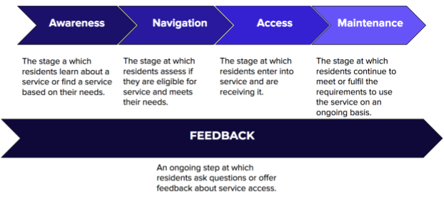

# Our approach

This page describes our approach to identify and prioritize City services to redesign and digitize, including how we are: 

* Defining “services” to build an inventory
* Prioritizing services for redesign and digitization
* Understanding and assessing accessibility to City services

## **Defining “services” to build an inventory**

For this project, we define a service as **an exchange of goods, services, or information between a person and the Austin city government**. In our inventory, services:

* Are community facing \(i.e., not business processes or internal systems within the City government\)
* Use a form or application to exchange information 

We are identifying services that the City of Austin's 40+ departments offer across a range of channels \(online, in-person, by mail, phone\) for a variety of users. Examples include:

* Reserving city space
* Requesting a rebate
* Applying for a permit or license
* Adopting an animal
* Volunteering with the city

## **Prioritizing services for redesign and digitization**

Our approach to prioritizing services considers three primary factors:

1. **Impact**: How important or worthwhile the service is to redesign or put online. We should focus on redesigning and bring online City services that have the highest impact on Austin communities.
2. **Feasibility**: How easy the service would be to redesign or put online. We should consider feasibility in how we sort services to redesign and bring online -- but not focus on the easiest services alone. We should achieve a balance.
3. **Accessibility**: What barriers people may face in accessing and using the service. We should focus on services that have the clearest need for more accessibility. 

### **Assessing the impact of a City service** 

In principle, the most impactful City services are services that:

* **Impact a large number of residents**, rather than a smaller number of residents
* **Are critical to the people they serve**, rather than elective or nonessential services 
* **Residents come into contact with a lot**, as opposed to services that residents don’t interact with often
* **Support priorities in** [**Austin’s Strategic Direction 2023**](https://www.austintexas.gov/strategicplan), which outlines outcomes and indicators for City departments \([list of the Austin Council’s priority indicators from 2018](https://austinstrategicplan.bloomfire.com/posts/3226720-council-s-top-10-indicators)\)
* **Promote racial equity**, a core value of Strategic Direction 2023 that City departments are integrating into how we work
* **Enable operational efficiencies**, such as saving time or cost, and sharing tools and services across City programs
* **Generate revenues or funding** for departments to provide services
* **Help preparedness or risk mitigation**, such as security and disaster preparedness

This is a divergent list of the many factors we need to consider in prioritizing services. And there are many contradictions and tradeoffs within this list. Few, if any, services would rate highly on all these principles.

### **Assessing the feasibility of redesigning or digitizing a City service**

Feasibility factors we will consider include:

* **Business process**: How many City departments coordinate in delivering a service. Services that involve fewer departments tend to be easier to redesign and digitize.
* **Legal or contractual requirements from outside entities**: How a City service connects with or depends on an entity outside the City of Austin \(e.g., nonprofit, state or federal government agency\). These outside funders and partners can have requirements on how the City delivers a service. So services that the City of Austin alone delivers tend to be easier to redesign than those that rely on external funding or tie-in with another level of government.  
* **Technological requirements**: Whether the service would need more complicated technology such as payments or digital identity. Services with simpler technology needs tend to be easier to redesign and digitize. 
* **Funding requirements**: Whether the service must consider requirements from outside funding sources \(e.g., grantor, federal government\). Services that do not have to follow funding requirements tend to be easier to redesign and digitize. 

## **Understanding and assessing accessibility**

A [2017 Office of the City Auditor report](http://www.austintexas.gov/sites/default/files/files/Auditor/Audit_Reports/Online_Access__October_2017_.pdf) recommended an “inventory of services across the city that should be brought online and/or need significant improvements related to usability or accessibility.” Technology is a key tool in making services more accessible to the community. But putting a service online does not guarantee it will be accessible for 100% of the community. Through this project we are considering a broad view of accessibility in identifying what City services we can bring online. 

### **Defining accessibility**

For this project, we define accessibility as enabling 100% of residents to access and use City services. It is the underlying value that enables the City of Austin to be a community where everyone can participate fully without barriers. 

Barriers to access occur when the design and delivery of a service does not match a community's experiences and needs. For example, requiring payment in the form of a credit card excludes individuals that do not have bank accounts and cannot get access to credit. Likewise, only taking appointments by phone can exclude thousands of residents who have hearing and speech disabilities. 

This project is considering some of the following dimensions of accessibility:

* **Physical and sensory disabilities**: According to the [Texas Workforce Investment Council](https://gov.texas.gov/uploads/files/organization/twic/People-With-Disabilities-2019.pdf), 8.4% of Travis County residents have some kind of disability. This includes tens of thousands of residents with visual, hearing, and ambulatory disabilities. 
* **Financial access**: According to a recent [Federal Deposit Insurance Corporation](https://economicinclusion.gov/surveys/place-data.html?where=Austin_Round_Rock_TX&when=2017) survey, 3.8% of residents in the Austin-Round Rock area are unbanked \(only use cash, are not served by a bank or mainstream financial institution\). These community members may not have credit cards or bank accounts that some City services require for payment. 
* **Digital access and literacy**: According to the City of Austin’s [2018 Austin Digital Assessment](https://data.austintexas.gov/stories/s/2018-Austin-Digital-Assessment/p9uh-zqz4/), 5% of respondents lack a home internet connection. Even more do not have mobile data plans to access City services on their phones. Many other residents lack devices or the skills necessary to use the Internet.

### **Accessibility as a resident’s journey** 

To understand the accessibility of City services, we focus on several stages that residents go through to find and enter City services \(listed below and in the image that follows\):

1. **Awareness**: How a resident learns about a City service or finds a service based on their need.
2. **Navigation**: How a resident assess if they are eligible for the service and whether the service meets their need.
3. **Access**: How a resident enters into the service, exchanges information, and receives the service.
4. **Maintenance**: How a resident continues to meet the requirements of the service or continue to receive the service over time.
5. **Feedback**: The ongoing process throughout all steps to ask questions or offer feedback about the service.

There are barriers to accessing service along different dimensions at each stage in the journey. Our vision for this project is to remove these barriers such that 100% of residents are able to find, navigate, and use the services. 

