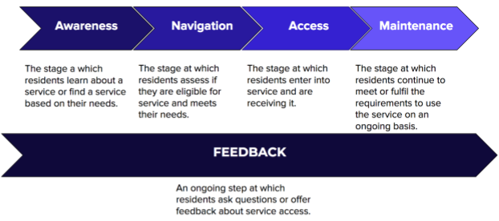

# Understanding and assessing accessibility

A [2017 Office of the City Auditor report](http://www.austintexas.gov/sites/default/files/files/Auditor/Audit_Reports/Online_Access__October_2017_.pdf) recommended an “inventory of services across the city that should be brought online and/or need significant improvements related to usability or accessibility.” Technology is a key tool in making services more accessible to the community. But putting a service online does not guarantee it will be accessible for 100% of the community. Through this project we are considering a broad view of accessibility in identifying what City services we can bring online. 

## **Defining accessibility**

For this project, we define accessibility as enabling 100% of residents to access and use City services. It is the underlying value that enables the City of Austin to be a community where everyone can participate fully without barriers. 

Barriers to access occur when the design and delivery of a service does not match a community's experiences and needs. For example, requiring payment in the form of a credit card excludes individuals that do not have bank accounts and cannot get access to credit. Likewise, only taking appointments by phone can exclude thousands of residents who have hearing and speech disabilities. 

This project is considering some of the following dimensions of accessibility:

* **Physical and sensory disabilities**: According to the [Texas Workforce Investment Council](https://gov.texas.gov/uploads/files/organization/twic/People-With-Disabilities-2019.pdf), 8.4% of Travis County residents have some kind of disability. This includes tens of thousands of residents with visual, hearing, and ambulatory disabilities. 
* **Financial access**: According to a recent [Federal Deposit Insurance Corporation](https://economicinclusion.gov/surveys/place-data.html?where=Austin_Round_Rock_TX&when=2017) survey, 3.8% of residents in the Austin-Round Rock area are unbanked \(only use cash, are not served by a bank or mainstream financial institution\). These community members may not have credit cards or bank accounts that some City services require for payment. 
* **Digital access and literacy**: According to the City of Austin’s [2018 Austin Digital Assessment](https://data.austintexas.gov/stories/s/2018-Austin-Digital-Assessment/p9uh-zqz4/), 5% of respondents lack a home internet connection. Even more do not have mobile data plans to access City services on their phones. Many other residents lack devices or the skills necessary to use the Internet.

## **Accessibility as a resident’s journey** 

To understand the accessibility of City services, we focus on several stages that residents go through to find and enter City services \(listed below and in the image that follows\):

1. **Awareness**: How a resident learns about a City service or finds a service based on their need.
2. **Navigation**: How a resident assess if they are eligible for the service and whether the service meets their need.
3. **Access**: How a resident enters into the service, exchanges information, and receives the service.
4. **Maintenance**: How a resident continues to meet the requirements of the service or continue to receive the service over time.
5. **Feedback**: The ongoing process throughout all steps to ask questions or offer feedback about the service.

There are barriers to accessing service along different dimensions at each stage in the journey. Our vision for this project is to remove these barriers such that 100% of residents are able to find, navigate, and use services. 

\*\*\*\*

