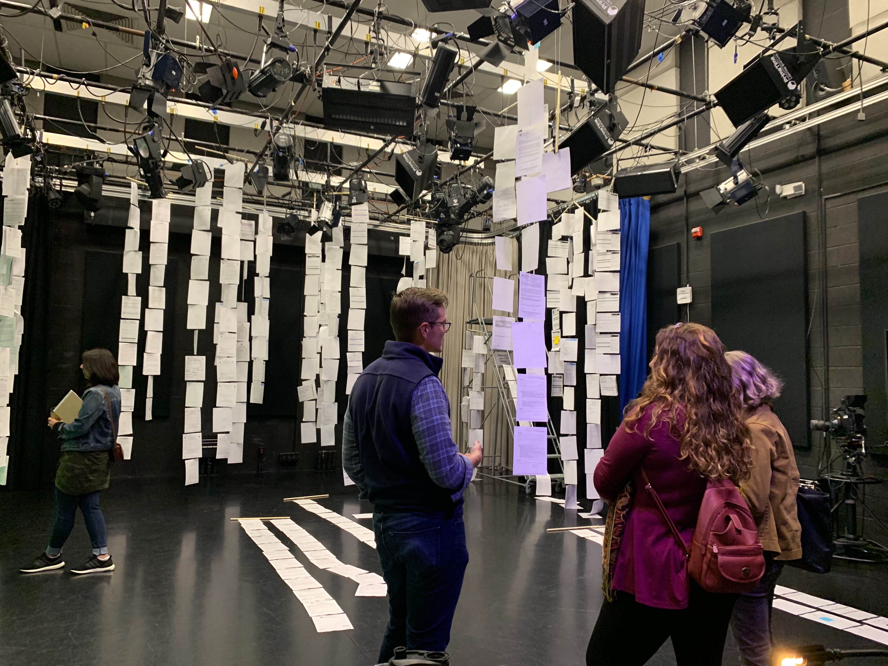
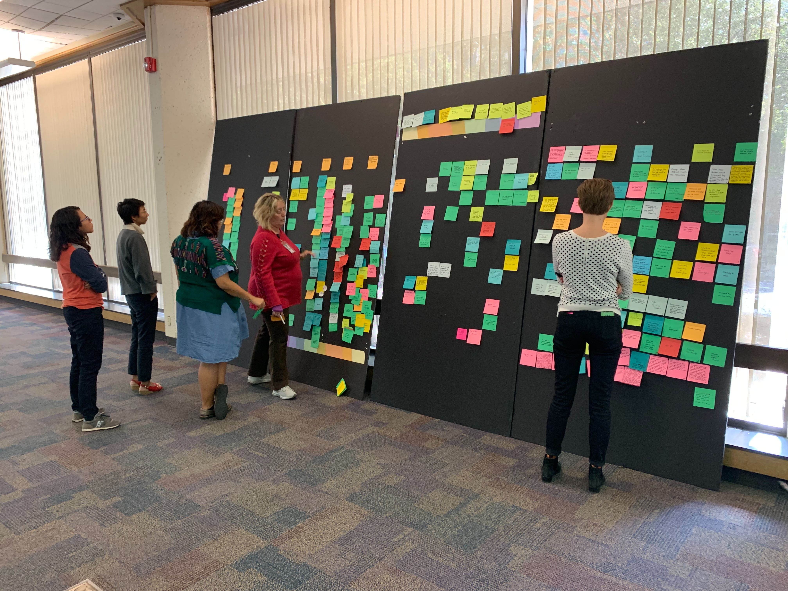

# Events and workshops

## **Project kickoff workshop - June 27, 2019**

We held a kickoff workshop to introduce City staff to the project and invite contributions into how we define accessibility for City services. The meeting included:

* An overview of the project's context, goals, and timeline
* Lightning talks from City staff in various departments that work to make City services more accessible and usable
* Discussion of common stages in accessibility, which we are using to develop a rubric for assessing services \(and will publish on this site soon\)
* A workshop to understand how residents find, access, and participate in public services, including barriers that residents face to accessing those services

[Presentation slides from project kickoff workshop](https://docs.google.com/presentation/d/14rSnRPAtLd7N9cvbKmxl07mCc3DuGuZgSUOV83ZpFUM/edit?usp=sharing) 

[Photos from the project kickoff workshop](https://photos.app.goo.gl/vXZEceZVSrz5rxxu7)

Video from project kickoff workshop \(coming soon\)

## **Building Better Government: Accessibility defined by residents  - September 12, 2019**

A central part of our work is understanding what accessibility means to residents who access or attempt to access services at the city. At the workshop we met residents and talked about:

* Our project including goals, processes, and next steps 
* Ran an exercise with residents to identify barriers around different factors such as transportation, financial, physical, digital, content, etc.
* Discussed what a service journey is, how we are using it as a framework, and then mapped barriers to the different stages of the journey

[Presentation slides from the Building Better Government workshop ](https://docs.google.com/presentation/d/1Rw66X3tIYhSP8-lPivUypYKQ7AzhR5toGdxCZXMu9Ds/edit?usp=sharing)

[Photos from the Building Better Government workshop](https://drive.google.com/open?id=1cB4nevcpIrfi2jHjB3TC9TuFGSJt2pWC)

[Live caption transcript](https://drive.google.com/open?id=1Ui1FoaaXmAbOmFV0Y7edtI9XoIkxgqc2)

## **The City: A journey through 500 forms** **- October 11, 2019**

In addition to workshops, we also organized an installation of all the forms that exist on the City of Austin's website. We prompted attendees to reimagine how we deliver services, and asked them how all of these forms made them feel.

[Photos from the installation](https://drive.google.com/drive/folders/1ynaTsLvilj-5NE4f8N_2BxyMTMCNJ0Z0?usp=sharing)

## **Co-Synthesis - October 22 and 23, 2019**

Synthesis is a collaborative sense-making process, which helps to summarize large amounts of data into patterns, outliers, and ultimately insights. We invited residents and city staff to come in, review all of the comments that we had collected from past events and help discover patterns and themes within data. This work sparked several new comments about access.

Qualitative data and insights on accessibility \(Coming soon\)

## Presentations and briefings

In addition to the workshops mentioned above, we also presented to and received feedback from the Mayor's Committee for People with Disabilities, the Equity Office, employees and residents at Digital Inclusion Week and attendees of the 2019 Civic Future's Summit. You can find links to the presentations below:

* [Presentation to the Equity Action Team](https://docs.google.com/presentation/d/1IrRJIRcmcgVstbD3sehKCs3U4YKZXEU8HCq4poa9P7g/edit?usp=sharing) - September 27, 2019
* [Presentation at the Civic Futures Summit](https://docs.google.com/presentation/d/1eGQ5qqAQ4hdhNC42AsaB--07ysKndPTgo8iWhT0XMJg/edit?usp=sharing) - October 1, 2019
* [Digitizing Services at the City of Austin: Creating Holistic Access for Residents ](https://docs.google.com/presentation/d/1-5u_fXvN3w2y0EIYNSbHwYSo3ISgS0CJJ8ur4yX25Q8/edit?usp=sharing)- October 7, 2019
* [Presentation to the Mayor's Committee for People with Disabilities](https://docs.google.com/presentation/d/15UDikJOFBhYjVlf2-xI9pA91c2N999URotj8xfGesxQ/edit?usp=sharing) - October 11, 2019
* [Presentation to the Community Technology and Telecommunications Commission](https://drive.google.com/file/d/1P3hL7Q1KSu98XzUDoe8Ujlovirjw47MX/view?usp=sharing) - January 8, 2020 \([access the video from the meeting here](https://gcc01.safelinks.protection.outlook.com/?url=http%3A%2F%2Faustintx.swagit.com%2Fplay%2F01082020-1107%2F6%2F&data=02%7C01%7CDaniel.Honker%40austintexas.gov%7C74c10b2d4e174d9ad62908d7952688b4%7C5c5e19f6a6ab4b45b1d0be4608a9a67f%7C0%7C0%7C637141865038123218&sdata=TWw%2Baw%2BP31pbc2hWY2l%2FY8j4AcaftkbTCzSrcFzshQ0%3D&reserved=0)\)

